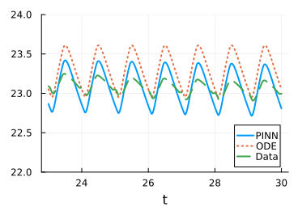

# PINNFuser.jl

**PINNFuser** is a research-oriented Julia library for enhancing ordinary differential equation (ODE) models using Physics-Informed Neural Networks (PINNs).

The project was developed as part of a bachelor's thesis and focuses on combining physics-based models with data-driven neural network corrections, with particular emphasis on cardiovascular system modeling.

---

## Overview

Physics-Informed Neural Networks (PINNs) allow known physical laws to be incorporated directly into the training process of a neural network. **PINNFuser** provides a simple interface for applying PINNs to ODE-based models, enabling improved accuracy when only limited measurement data are available.

There are several loss configurations that can be implemented (see `src/Losses.jl`) in combinations of two: data, first derivative, mass conservation, periodicity, non-negative volumes and zero-mean contributions.

`src/PINN_Infuser` is the core file of this training architecture. Refer to it to fully comprehend the nature of this repository.

## Installation

PINNFuser is not registered in the Julia General package registry. Clone the repository and add it to your Julia environment manually:

```bash
git clone https://github.com/elenagomezdelpozo/PINNFuser.jl
```

Then, from the Julia REPL, activate and instantiate the project environment:

```julia
using Pkg
Pkg.activate("path/to/PINNFuser.jl")
Pkg.instantiate()
```

---

## Example Result

The figure below shows an example result obtained using a one-chamber cardiovascular model enhanced with a Physics-Informed Neural Network. The ground truth data were generated using a significantly more complex four-chamber cardiovascular model. The PINN correction allows the simplified ODE model to achieve improved accuracy while retaining its simplicity.



See the full worked example — including model definition, training, and extrapolation — in the [one-chamber model example](https://github.com/elenagomezdelpozo/PINNFuser.jl/blob/main/examples/OneChamberModelCVS).

---

## Usage

A typical workflow with PINNFuser looks like:

1. Define your base ODE model (e.g., a lumped-parameter cardiovascular model).
2. Provide measurement data (from `data/` or your own source).
3. Configure training parameters at `src/Parameters.jl` and train a PINN correction on top of the ODE model.
4. Evaluate and visualize the corrected model's predictions at `local_scripts/Visualize.jl` or `local_scripst/Test.jl` (see `figures/`).

Refer to the scripts in `local_scripts/` for local runs and `hpc_scripts/` for running training on a cluster. These files will run the `main/main` file automatically.

---

## License

This project is distributed under the terms of the license included in the [LICENSE](./LICENSE) file.

---

## Acknowledgements

This repository was developed as part of a bachelor's thesis and is forked from [mdydek/PINNFuser.jl](https://github.com/mdydek/PINNFuser.jl).
